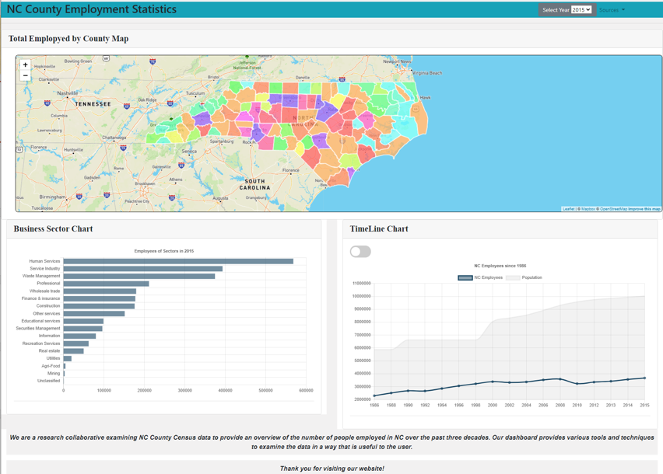

# NC County Statistics

North Carolina, especially Triangle, has known as one of the fastest growing area. Thanks to NC Census data which provides valuable insight into growth and demographic changes overtime,  we develop a consolidated dashboard of NC county statistics for multiple years. This project focuses on the employment growth of NC state and each county.  

The dashboard provides a map centered in North Carolina and charts visibly with the number of employed people for the selected years.  Users have option to select a year from 2014 to 2018, and then drill down into the data per county in NC to learn more about each county.

## Team members:

* Niral Patel
* Eunjeong Lee
* Bill Pezzullo
* Abby Pearson
* Teshanee Williams

## Screenshots of Page:

For further images of the dashboard,

* [Dashboard Page-county selected](images/Screenshot_dashboard2.png)

* [Bar Chart of Business Sectors](images/Screenshot_bar.png)

* [TimeLine Chart of Employment](images/Screenshot_line2.png)

* [TimeLine Chart of Employment with Population](images/Screenshot_line.png)

### Data sources:

* Employment Census:

   [Community Business Pattern(CBP)](https://www.census.gov/programs-surveys/cbp.html)

   [CBP API](https://www.census.gov/data/developers/data-sets/cbp-nonemp-zbp/cbp-api.html)

* NC County Map

   [Geojson](https://opendata.arcgis.com/datasets/d192da4d0ac249fa9584109b1d626286_0.geojson)

* Population:

   [NC Census 1990](https://www.osbm.nc.gov/facts-figures/demographics/1990-2000-county-growth)

   [Population Estimate Program API](https://www.census.gov/data/developers/data-sets/popest-popproj/popest.2000-2010_Intercensals.html)

   [NC OSBM](https://files.nc.gov/ncosbm/demog/countytotals_2010_2019.html)

## Data and Functions Flow:
   The page runs over the back-end server which uses Python Flask and MongoDB. The front-end page is built using Javascript and HTML along with the tools D3, Leaflet, Mapbox, HTML, Bootstrap and ChartJS.

   The overall data flow is displayed in the diagram [Data Flow Diagram](images/HighLevel%20FLow.jpeg).

   The data flow among the functions is displayed in the detailed diagram [Function Flow Diagram](images/Function%20Flow.jpeg)

## The API Routes

The back-end provides the following api routes accessed from static/js/map.js and stattic/js/charts.js.

   * Loading data to MongoDB (Initialize)

      `/reload_geo`
         loading the NC county map geojson data to MongoDB mygrid database
         
      `/reload_census`
         loading the county employment data to MongoDB censusdb-census collection
         
      `/reload_nccensus`
         loading the statewide employment data to MongoDB censusdb-nccensus collection

   * Get Map, County codes data

      `/get_geo`
         getting the NC county map data
         
      `/get_combined_codes`
         getting the county codes

   * Get EMP data

      `/get_census/<year>`
         getting the employment data for all counties of the given year
         
      `/get_county_data/<county>`
         getting the given county's employment data for all years (1986~2018)
         
      `/get_nc_data/<year>`
         getting the employment data for NC of the given year
         
      `/get_nc_total/<year>`
         getting the statewide employment data from 1986 upto the given year

   * Get Population data

      `/get_population/<year>/<county>`
         getting the given county's population of the given year
         
      `/get_pop/<year>`
         getting the population data for all counties of the given year

